.OLL Algorithms
[width="80%",cols="1,^3,^3l,10",options="header"]
|=========================================================
|Case |Diagram |Algorithm |Comments

|1  | 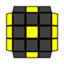 |
R U2 R2' F R F' U2 R' F R F'
|
4 F2L triggers, not great, but not bad for a dot case.
| 2 | 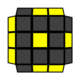 |
F R U R' U' F' f R U R' U' f'
|
two FRURUF's of varying wide-ness.
| 3 | 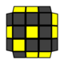 |
y F U R U' R' F' U F R U R' U' F'
|
I'm in the inverse-sexy fan club, and I don't love wide-F.
| 4 | 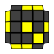 |
y F U R U' R' F' U' F R U R' U' F'
|
mirror of 3 (was pleasantly surprised that the recog for these two is nice).
| 5 | 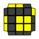 |
r' U2 R U R' U r
|
comments go here.
| 6 | 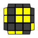 |
r U2 R' U' R U' r'
|
comments go here
| 7 | 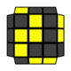 |
r U R' U R U2 r'
|
comments go here
| 8 | 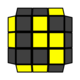 |
y2 r' U' R U' R' U2 r
|
comments go here
| 9 | 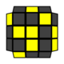 |
y R' U' R U' R B' R' B R' U2 R
|
like 10, but from the back
| 10 | 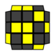 |
R U R' U R' F R F' R U2 R'
|
3 F2L triggers, I like this a lot.
| 11 | 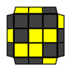 |
alg goes here
|
comments go here
| 12 | 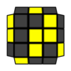 |
alg goes here
|
comments go here
| 13 | 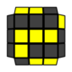 |
alg goes here
|
comments go here
| 14 | 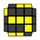 |
alg goes here
|
comments go here
| 15 | 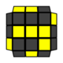 |
alg goes here
|
comments go here
| 16 | 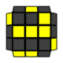 |
alg goes here
|
comments go here
| 17 | 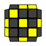 |
alg goes here
|
comments go here
| 18 | 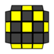 |
alg goes here
|
comments go here
| 19 | 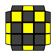 |
alg goes here
|
comments go here
| 20 | 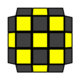 |
alg goes here
|
comments go here
| 21 | 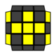 |
alg goes here
|
comments go here
| 22 | 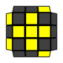 |
alg goes here
|
comments go here
| 23 | 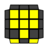 |
alg goes here
|
comments go here
| 24 | 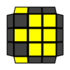 |
alg goes here
|
comments go here
| 25 | 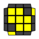 |
alg goes here
|
comments go here
| 26 | 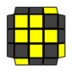 |
alg goes here
|
comments go here
| 27 | 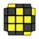 |
alg goes here
|
comments go here
| 28 | 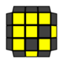 |
alg goes here
|
comments go here
| 29 | 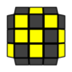 |
alg goes here
|
comments go here
| 30 | 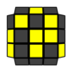 |
alg goes here
|
comments go here
| 31 | 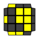 |
alg goes here
|
comments go here
| 32 | 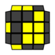 |
alg goes here
|
comments go here
| 33 | 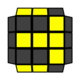 |
alg goes here
|
comments go here
| 34 | 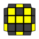 |
alg goes here
|
comments go here
| 35 | 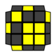 |
alg goes here
|
comments go here
| 36 | 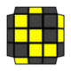 |
alg goes here
|
comments go here
| 37 | 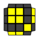 |
alg goes here
|
comments go here
| 38 | 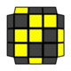 |
alg goes here
|
comments go here
| 39 | 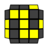 |
alg goes here
|
comments go here
| 40 | 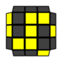 |
alg goes here
|
comments go here
| 41 | 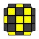 |
alg goes here
|
comments go here
| 42 | 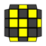 |
alg goes here
|
comments go here
| 43 | 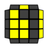 |
alg goes here
|
comments go here
| 44 | 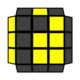 |
alg goes here
|
comments go here
| 45 | 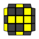 |
alg goes here
|
comments go here
| 46 | 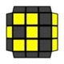 |
alg goes here
|
comments go here
| 47 | 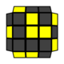 |
alg goes here
|
comments go here
| 48 | 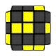 |
alg goes here
|
comments go here
| 49 | 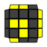 |
alg goes here
|
comments go here
| 50 | 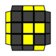 |
alg goes here
|
comments go here
| 51 |  |
alg goes here
|
comments go here
| 52 |  |
alg goes here
|
comments go here
| 53 | image:oll53.png[] |
alg goes here
|
comments go here
| 54 |  |
alg goes here
|
comments go here
| 55 |  |
alg goes here
|
comments go here
| 56 |  |
alg goes here
|
comments go here
| 57 |  |
alg goes here
|
comments go here
|=========================================================
