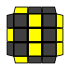
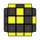

image:oll1.png[]

.OLL Algorithms
[width="80%",cols="1,^3,^3l,10",options="header"]
|=========================================================
|Case |Diagram |Algorithm |Comments

|1  | image:oll1.png[] |
R U2 R2' F R F' U2 R' F R F'
R U B' R B R2 U' R' F R F'
y R U' R2 D' r U' r' D R2 U R'
r U R' U R' r2 U' R' U R' r2 U2 r'
|
It all starts with a dot.

| 2 |  |
algs go here
algs go here
|
Comments go here.

| 3  |   | algs | comments
| 4  |   | algs | comments
| 5  | image:oll5.png[]  | algs | comments
| 6  | image:oll6.png[]  | algs | comments
| 7  |   | algs | comments
| 8  | image:oll8.png[]  | algs | comments
| 9  |   | algs | comments
| 10 |  | algs | comments
| 11 | image:oll11.png[] | algs | comments
| 12 | image:oll12.png[] | algs | comments
| 13 |  | algs | comments
| 14 | image:oll14.png[] | algs | comments
| 15 | image:oll15.png[] | algs | comments
| 16 | image:oll16.png[] | algs | comments
| 17 | image:oll17.png[] | algs | comments
| 18 | image:oll18.png[] | algs | comments
| 19 |  | algs | comments
| 20 | image:oll20.png[] | algs | comments
| 21 |  | algs | comments
| 22 |  | algs | comments
| 23 |  | algs | comments
| 24 | image:oll24.png[] | algs | comments
| 25 | image:oll25.png[] | algs | comments
| 26 | image:oll26.png[] | algs | comments
| 27 | image:oll27.png[] | algs | comments
| 28 |  | algs | comments
| 29 |  | algs | comments
| 30 |  | algs | comments
| 31 |  | algs | comments
| 32 |  | algs | comments
| 33 | image:oll33.png[] | algs | comments
| 34 | image:oll34.png[] | algs | comments
| 35 |  | algs | comments
| 36 | image:oll36.png[] | algs | comments
| 37 | image:oll37.png[] | algs | comments
| 38 |  | algs | comments
| 39 |  | algs | comments
| 40 |  | algs | comments
| 41 | image:oll41.png[] | algs | comments
| 42 |  | algs | comments
| 43 | image:oll43.png[] | algs | comments
| 44 | image:oll44.png[] | algs | comments
| 45 | image:oll45.png[] | algs | comments
| 46 | image:oll46.png[] | algs | comments
| 47 | image:oll47.png[] | algs | comments
| 48 | image:oll48.png[] | algs | comments
| 49 |  | algs | comments
| 50 | image:oll50.png[] | algs | comments
| 51 |  | algs | comments
| 52 |  | algs | comments
| 53 | image:oll53.png[] | algs | comments
| 54 |  | algs | comments
| 55 |  | algs | comments
| 56 | image:oll56.png[] | algs | comments
| 57 | image:oll57.png[] | algs | comments

|=========================================================
