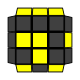

.OLL Algorithms
[width="80%",cols="1,^3,^3l,10",options="header"]
|=========================================================
|Case |Diagram |Algorithm |Comments

|1  | image:oll1.png[] |
R U2 R2' F R F' U2 R' F R F'
|
4 F2L triggers, not great, but not bad for a dot case.
| 2 | image:oll2.png[] |
F R U R' U' F' f R U R' U' f'
|
two FRURUF's of varying wide-ness.
| 3 | image:oll3.png[] |
y F U R U' R' F' U F R U R' U' F'
|
I'm in the inverse-sexy fan club, and I don't love wide-F.
| 4 | image:oll4.png[] |
y F U R U' R' F' U' F R U R' U' F'
|
mirror of 3 (was pleasantly surprised that the recog for these two is nice).
| 5 | image:oll5.png[] |
r' U2 R U R' U r
|
comments go here.
| 6 |  |
r U2 R' U' R U' r'
|
comments go here
| 7 | image:oll7.png[] |
r U R' U R U2 r'
|
comments go here
| 8 |  |
y2 r' U' R U' R' U2 r
|
comments go here
| 9 | image:oll9.png[] |
y R' U' R U' R B' R' B R' U2 R
|
like 10, but from the back
| 10 | image:oll10.png[] |
R U R' U R' F R F' R U2 R'
|
3 F2L triggers, I like this a lot.
| 11 |  |
alg goes here
|
comments go here
| 12 |  |
alg goes here
|
comments go here
| 13 | image:oll13.png[] |
alg goes here
|
comments go here
| 14 |  |
alg goes here
|
comments go here
| 15 | image:oll15.png[] |
alg goes here
|
comments go here
| 16 |  |
alg goes here
|
comments go here
| 17 |  |
alg goes here
|
comments go here
| 18 | image:oll18.png[] |
alg goes here
|
comments go here
| 19 | image:oll19.png[] |
alg goes here
|
comments go here
| 20 |  |
alg goes here
|
comments go here
| 21 | image:oll21.png[] |
alg goes here
|
comments go here
| 22 | image:oll22.png[] |
alg goes here
|
comments go here
| 23 | image:oll23.png[] |
alg goes here
|
comments go here
| 24 |  |
alg goes here
|
comments go here
| 25 |  |
alg goes here
|
comments go here
| 26 |  |
alg goes here
|
comments go here
| 27 |  |
alg goes here
|
comments go here
| 28 | image:oll28.png[] |
alg goes here
|
comments go here
| 29 | image:oll29.png[] |
alg goes here
|
comments go here
| 30 | image:oll30.png[] |
alg goes here
|
comments go here
| 31 | image:oll31.png[] |
alg goes here
|
comments go here
| 32 | image:oll32.png[] |
alg goes here
|
comments go here
| 33 |  |
alg goes here
|
comments go here
| 34 |  |
alg goes here
|
comments go here
| 35 | image:oll35.png[] |
alg goes here
|
comments go here
| 36 |  |
alg goes here
|
comments go here
| 37 |  |
alg goes here
|
comments go here
| 38 | image:oll38.png[] |
alg goes here
|
comments go here
| 39 | image:oll39.png[] |
alg goes here
|
comments go here
| 40 | image:oll40.png[] |
alg goes here
|
comments go here
| 41 |  |
alg goes here
|
comments go here
| 42 | image:oll42.png[] |
alg goes here
|
comments go here
| 43 |  |
alg goes here
|
comments go here
| 44 |  |
alg goes here
|
comments go here
| 45 |  |
alg goes here
|
comments go here
| 46 |  |
alg goes here
|
comments go here
| 47 |  |
alg goes here
|
comments go here
| 48 |  |
alg goes here
|
comments go here
| 49 | image:oll49.png[] |
alg goes here
|
comments go here
| 50 |  |
alg goes here
|
comments go here
| 51 | image:oll51.png[] |
alg goes here
|
comments go here
| 52 | image:oll52.png[] |
alg goes here
|
comments go here
| 53 |  |
alg goes here
|
comments go here
| 54 | image:oll54.png[] |
alg goes here
|
comments go here
| 55 | image:oll55.png[] |
alg goes here
|
comments go here
| 56 |  |
alg goes here
|
comments go here
| 57 |  |
alg goes here
|
comments go here
|=========================================================
