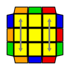
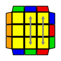
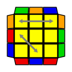
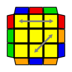

.PLL Algorithms
[width="80%",cols="1,^3,^3l,10",options="header"]
|=========================================================
|Case |Diagram |Algorithm |Comments

| Aa  | image:pll_Aa.png[] |
x R' U R' D2 R U' R' D2 R2 x'
|
The line between (x R') and (l) is blurry.

| Ab | image:pll_Ab.png[] |
x R2 D2 R U R' D2 R U' R x'
|
Comments go here.

| E |  |
x' R U' R' D R U R' D' R U R' D R U' R' D' x
|
All hail the lefty D'

| F |  |
R' U' F' R U R' U' R' F R2 U' R' U' R U R' U R
|
aka R' U' F' (T Perm)
| Ga |  |
R2 U R' U R' U' R U' R2 D U' R' U R D'
|
Drew Brads lists it as an option https://www.youtube.com/watch?v=r4dI0HkJYRk
Mats Valk seems to use it http://algdb.net/Users/User/104
Cornelius Dieckmann seems to use it: http://cubesolv.es/solve/4273
Bill Wang seems to use it: http://cubesolv.es/solve/1016
| Gb |  |
R' U' R U D' R2 U R' U R U' R U' R2 D
|
Also, on Drew Brads list.
Lucas Etter seems to use it: http://cubesolv.es/solve/4318
Alternate given in CYO's G-Perms like a pro: https://www.youtube.com/watch?v=bBIgtrq0lFc
| Gc | image:pll_Gc.png[] |
R2 U' R U' R U R' U R2 D' U R U' R' D
|
the least popular of the RUD options
Robert Yau solve using it: http://cubesolv.es/solve/1421
| Gd | image:pll_Gd.png[] |
R U R' U' D R2 U' R U' R' U R' U R2 D'
|
rounding out the RUD G-perms (0.83 by CYO https://www.youtube.com/watch?v=bBIgtrq0lFc )
| H |  |
M2 U M2 U2 M2 U M2
|
Comments go here.
| Ja | image:pll_Ja.png[] |
L' U' L F L' U' L U L F' L2 U L
R' U L' U2 R U' R' U2 R L
R' U2 R U R' U2 L U' R U L' ^(OH)^
|
Comments go here.
| Jb | image:pll_Jb.png[] |
R U R' F' R U R' U' R' F R2 U' R' U'
|
You take a R U R' F' from the end, and you put it in front (sung to the tune of the Jenga song).
| Na | image:pll_Na.png[] |
R U R' U (R U R' F' R U R' U' R' F R2 U' R') U2 R U' R'
|
setup, Jb, undo
| Nb |  |
R' U R U' R' F' U' F R U R' F R' F' R U' R
|
Comments go here.
| Ra |  |
y R U' R' U' R U R D R' U' R D' R' U2 R' U'
|
Comments go here.
| Rb |  |
R' U2 R U2 R' F R U R' U' R' F' R2' U'
|
Comments go here.
| T |  |
R U R' U' R' F R2 U' R' U' R U R' F'
|
Comments go here.
| Ua | image:pll_Ua.png[] |
R2 U' R' U' R U R U R U' R
y2 M2 U M U2 M' U M2
|
Probably the most common algs to learn from front/back
| Ub |  |
R' U R' U' R' U' R' U R U R2
R' U R' U' R3 U' R' U R U R2
y2 M2 U' M U2 M' U' M2
|
The R3 is basically a fingertrick variant for avoiding the regrip
| V |  |
R' U R' d' R' F' R2 U' R' U R' F R F
R' U2 R U2 L U' R' U L' U L U' R U L'
R' U2 R U2 L U' R' z R U' R U R' D R U'^(OH)^
|
The OH is written as "R' U2 R U2 L U' R' U L' U L U' R U L'" a lot of the time, but for execution specifics,
check https://www.youtube.com/watch?v=_Z2bgzObtY8
| Y |  |
F R U' R' U' R U R' F' R U R' U' R' F R F'
|
OLL xx + OLL xx , like T-perm, but backwards
| Z | image:pll_Z.png[] |
M2' U' M2' U' M' U2 M2' U2 M' U2
M' U M2 U M2 U M' U2 M2
M' U' M2 U' M2 U' M' U2 M2
R U R' U R' U' R' U R U' R' U' R2 U R^(OH)^
|

|=========================================================
